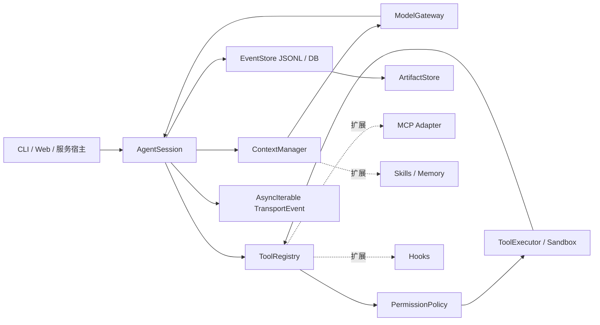

# Agent SDK（JavaScript）框架开发方案

> 版本：0.2（设计稿）  
> 依据：[Agent 平台设计蓝图](./agent-platform-design.html)  
> 目标：提供一个可嵌入 Node.js 服务、CLI 或 Web 应用的 JavaScript Agent 运行时 SDK。SDK 负责可靠地执行「LLM → 工具调用 → 工具结果回注」循环；界面、具体模型供应商、沙箱实现和业务工具均通过适配器接入。

## 1. 设计结论

SDK 不以 DAG 编排或多 Agent 框架为起点，而以一个可观测、可中断、可恢复的单 Agent 主循环为核心。它必须先具备以下能力：

- 模型自主选择工具，SDK 不承担外部任务编排；
- 工具输入以 JSON Schema 校验、输出结构化并受限截断；
- 回合消息、工具调用、权限决策和状态迁移形成可持久化事件；高频流式事件只经传输流发布；
- 取消、权限拒绝、超时和工具失败不会破坏会话，可继续下一轮；
- 上下文按稳定程度分层，并可在逼近窗口上限时压缩；
- 权限决策与执行环境分离，SDK 默认安全，宿主决定如何执行；
- MCP、Skills、Hooks、Memory 与子代理均为后续可插拔模块。

首版定位为 **Node.js 20+、TypeScript 优先、JavaScript 可直接使用** 的库。发布物同时包含 ESM、CommonJS 类型声明和最小 CLI 示例；浏览器环境只支持通过宿主提供的远端 `ToolExecutor` 执行敏感工具。

## 2. 边界与非目标

| SDK 负责 | SDK 不负责 |
| --- | --- |
| Agent 循环、状态机、消息和事件模型 | 自建模型推理服务 |
| 工具注册、参数校验、调用调度、结果裁剪 | 默认给予 Shell/文件系统/网络权限 |
| 权限请求协议与策略判定 | 操作系统级容器或虚拟机的具体实现 |
| 上下文装配、压缩触发和会话恢复 | 具体 UI 的渲染与交互设计 |
| 扩展点与参考适配器 | 第一期复杂的 DAG/群体 Agent 编排 |

这一区分避免 SDK 既成为 Web 框架又成为基础设施平台。执行隔离、密钥管理、审计存储可以由业务方按部署环境替换。

## 3. 总体架构



架构图源文件：[`agent-sdk-js-architecture.mmd`](./agent-sdk-js-architecture.mmd)，可在具备 Mermaid CLI 的环境中导出 SVG/PNG。

核心数据流为：宿主提交用户消息；`ContextManager` 组装请求；`ModelGateway` 以流方式返回文本和工具调用；`AgentSession` 顺序或并发执行相互独立的工具，再把结果作为工具消息回注；模型给出最终文本或会话被中止时结束本轮。**持久化事件先写入 `EventStore`，再向 UI 传输流发布；`model.text.delta`、工具进度等高频事件只发布，不落盘。**

## 4. 包与目录建议

采用 monorepo，避免核心运行时依赖具体模型、MCP SDK 或沙箱。

```text
packages/
  core/                 # AgentSession、状态机、消息/事件类型
  schema/               # Zod/JSON Schema 转换、公共错误定义
  tools/                # ToolRegistry、内建只读/文件工具协议
  context/              # 分层装配、预算、压缩和文件状态
  permissions/          # 策略、授权规则和权限请求
  storage/              # EventStore、ArtifactStore、JSONL 参考实现
  provider-openai/      # OpenAI Responses API 适配器（可选包）
  provider-anthropic/   # Anthropic 适配器（可选包）
  mcp/                  # MCP client 到 Tool 的映射（V2）
  node-executor/        # Node 文件/进程执行器（可选且显式启用）
  cli/                  # 示例 CLI，而非 core 依赖
examples/
  simple-chat/
  coding-agent/
```

依赖原则：`core` 只能依赖 `schema`；可选包通过 peer dependency 提供。运行时用标准 `AsyncIterable` 和 `AbortSignal`，不锁定 RxJS 或任何 Web 框架。

## 5. 核心抽象与 API 草案

### 5.1 创建会话

```ts
import { AgentSession, defineTool, jsonlEventStore } from "@agent-sdk/core";

const session = new AgentSession({
  model: gateway,
  tools: [readFile, editFile, runCommand],
  context: { system: SYSTEM_PROMPT, contextWindowTokens: 100_000 },
  permissions: { policy: permissionPolicy, store: permissionStore, permissionTimeoutMs: 300_000 },
  eventStore: jsonlEventStore(".agent/sessions/demo.jsonl"),
});

const controller = new AbortController();
for await (const event of session.run("修复登录页的空状态", {
  signal: controller.signal,
})) {
  render(event);
}
```

`run()` 每次对应一个用户回合，返回 `AsyncIterable<TransportEvent>`。这让 CLI 可边打印边执行，HTTP 服务可转成 SSE，Web 应用可转成 `ReadableStream`；SDK 不耦合其传输层。若流发布 `permission.requested`，迭代器会保持挂起；宿主必须调用 `resolvePermission()`、取消信号，或等待 `permissionTimeoutMs` 到期（默认 5 分钟，到期按拒绝处理），随后才继续产生事件。

```ts
await session.resolvePermission(requestId, { type: "allow-once" });
// 或将经校验的、窄作用域规则存入 PermissionStore。
await session.resolvePermission(requestId, { type: "allow-with-rule", rule });
```

```ts
export interface AgentSession {
  run(input: string | AgentMessage, options?: { signal?: AbortSignal }): AsyncIterable<TransportEvent>;
  resolvePermission(requestId: string, decision: PermissionDecision): Promise<void>;
}
```

### 5.2 模型网关

```ts
export interface ModelGateway {
  stream(request: ModelRequest, options: { signal: AbortSignal }): AsyncIterable<ModelDelta>;
  estimateTokens(input: TokenEstimateInput): Promise<TokenEstimate>;
}

export interface ModelRequest {
  messages: AgentMessage[];
  tools: ModelToolDefinition[];
  maxOutputTokens?: number;
}

export interface TokenEstimateInput { messages: AgentMessage[]; tools: ModelToolDefinition[]; }
export interface TokenEstimate { tokens: number; source: "provider" | "heuristic"; }
export interface ModelToolDefinition { name: string; description: string; inputSchema: JsonSchema; }

export type ModelDelta =
  | { type: "text-delta"; text: string }
  | { type: "tool-call-delta"; id: string; name?: string; inputTextDelta: string }
  | { type: "tool-call"; id: string; name: string; input: unknown }
  | { type: "usage"; inputTokens: number; outputTokens: number }
  | { type: "finish"; reason: "stop" | "tool-use" | "length" };
```

供应商适配器必须把各家工具调用格式归一化为上述事件，且不能在适配器中执行业务工具。工具参数分片以 `tool-call-delta` 提供给观测层；core 只在收到完整、可解析并通过 Schema 校验的 `tool-call` 后创建持久化 `tool.requested` 事件。网关负责供应商重试、速率限制、流中断归一化和可选的提示词缓存标记。

### 5.3 工具协议

```ts
export interface Tool<TInput = unknown, TResult = unknown> {
  name: string;
  description: string;              // 写给模型的使用条件与边界
  inputSchema: JsonSchema;
  risk: "read" | "write" | "execute" | "external" | "agent";
  parallelSafe?: boolean;
  idempotency?: "never" | "safe";
  execute(input: TInput, ctx: ToolContext): Promise<ToolResult<TResult>>;
}

export type JsonSchema = Record<string, unknown>; // JSON Schema Draft 2020-12 子集
export type ToolProgressEvent = { message: string; percent?: number };
export declare function defineTool<TInput, TResult>(tool: Tool<TInput, TResult>): Tool<TInput, TResult>;

export type ToolResult<T = unknown> = ToolSuccess<T> | ToolFailure;

export interface ToolSuccess<T = unknown> {
  ok: true;
  content: Array<{ type: "text"; text: string } | { type: "json"; value: T }>;
  artifact?: ArtifactRef;           // 大结果全文的持久化引用，不默认注入上下文
  truncated?: { omitted: number; retrievalHint: string };
}

export interface ToolFailure {
  ok: false;
  error: { code: string; message: string; retryable: boolean; hint?: string };
  content: Array<{ type: "text"; text: string }>;
}

export interface ToolContext {
  sessionId: string;
  callId: string;
  signal: AbortSignal;
  workspace?: string;
  emit(event: ToolProgressEvent): void;
}
```

注册时把 `inputSchema` 转换为模型可理解的 JSON Schema；运行前验证输入。校验失败、权限拒绝、超时和可恢复的执行错误统一返回 `ToolFailure` 给模型，而不是抛出致使回合丢失的异常。完整工具结果先由 `ArtifactStore` 写入，`ToolSuccess` 仅保留摘要、裁剪后的内容及 `ArtifactRef`。

内建工具按最小正交集合实现：`read`、`glob`、`grep`、`write`、`edit`、`bash`。`edit` 使用精确的 `oldText`/`newText` 替换，拒绝依赖脆弱的行号 diff；文件状态追踪器默认要求同一会话已读取目标文件才能编辑。

### 5.4 事件、状态、产物与恢复

```ts
export type SessionState =
  | "idle" | "building-context" | "streaming"
  | "awaiting-permission" | "executing-tool" | "compacting"
  | "completed" | "interrupted" | "failed";

export interface AgentMessage {
  id: string;
  role: "system" | "user" | "assistant" | "tool";
  content: MessageContent[];
  createdAt: string;
}

export type MessageContent =
  | { type: "text"; text: string }
  | { type: "tool-call"; call: ToolCall }
  | { type: "tool-result"; callId: string; result: ToolResult };
export interface ToolCall { id: string; name: string; input: unknown; }
export interface PermissionScope {
  workspace?: string;
  pathPrefix?: string;
  executable?: string;
  argsPrefix?: string[];
}
export interface PermissionRule {
  id: string; tool: string; risk: Tool["risk"]; scope: PermissionScope; expiresAt: string;
}
export interface PermissionStore {
  createRule(rule: PermissionRule): Promise<PermissionRule>;
  listRules(filter?: { workspace?: string; tool?: string }): Promise<PermissionRule[]>;
  revokeRule(id: string): Promise<void>;
}
export interface PermissionRequest {
  id: string; tool: string; risk: Tool["risk"]; scope: PermissionScope; expiresAt: string;
}
export type PermissionDecision =
  | { type: "allow-once" }
  | { type: "allow-with-rule"; rule: PermissionRule }
  | { type: "deny"; reason?: string };
export type InterruptReason = "aborted" | "permission-timeout" | "step-limit" | "turn-timeout";
export interface AgentError { code: string; message: string; cause?: unknown; }

export type DurableEvent =
  | { type: "turn.started"; turnId: string; at: string }
  | { type: "message.appended"; message: AgentMessage }
  | { type: "tool.requested"; call: ToolCall }
  | { type: "permission.requested"; request: PermissionRequest }
  | { type: "permission.resolved"; requestId: string; decision: PermissionDecision }
  | { type: "tool.completed"; callId: string; result: ToolResult }
  | { type: "context.compacted"; snapshot: ContextSnapshot; replacesThroughSequence: number }
  | { type: "session.state.changed"; state: SessionState }
  | { type: "turn.completed"; messageId: string }
  | { type: "turn.interrupted"; reason: InterruptReason }
  | { type: "turn.failed"; error: AgentError };

export type TransportEvent = DurableEvent
  | { type: "model.text.delta"; text: string }
  | { type: "model.tool-call.delta"; id: string; inputTextDelta: string }
  | { type: "tool.progress"; callId: string; message: string };

export interface ArtifactRef { id: string; sha256: string; mediaType: string; byteLength: number; }
export interface ContextSnapshot {
  summary: string; messages: AgentMessage[]; fileState: Record<string, { version: string; ranges: string[] }>;
}
export interface ArtifactStore {
  put(value: Uint8Array | string, options: { mediaType: string }): Promise<ArtifactRef>;
  get(ref: ArtifactRef): Promise<Uint8Array>;
}
export interface StoredEvent { sequence: number; event: DurableEvent; }
export interface EventStore {
  append(event: DurableEvent): Promise<StoredEvent>;
  readAfter(sequence: number): AsyncIterable<StoredEvent>;
}
export interface CommandInput { executable: string; args: string[]; cwd: string; }
```

`EventStore.append()` 是 `DurableEvent` 的唯一事实来源；`TransportEvent` 中的 delta 和进度不允许写入 `EventStore`。MVP 的 `storage` 包同时提供 append-only JSONL `EventStore` 和内容寻址的本地 `ArtifactStore`；事件只保存 `ArtifactRef`、摘要和检索提示，借由内容哈希校验引用完整性。

恢复从最新 `context.compacted` 的持久化快照开始，重放其后的 `DurableEvent`；压缩器的运行不参与恢复，因此不要求摘要模型确定性。遇到存在 `tool.requested` 而无 `tool.completed` 的调用，恢复器追加一个合成的 `tool.completed` 事件，其中结果为错误码 `TOOL_INTERRUPTED` 的 `ToolFailure`，再交还模型决定下一步。SDK 默认**永不自动重跑**该工具；只有 `idempotency: "safe"` 且宿主恢复策略明确批准时，才可发起新的调用（使用新 `callId`）。

## 6. 主循环与并发规则

```text
接收用户输入
  → 记录 turn.started，构建分层上下文
  → 流式请求模型并发布文本/工具调用事件
  → 没有工具调用：记录最终消息，转 completed
  → 有工具调用：逐个执行权限判定与工具调用
  → 将受控、截断后的结果追加为 tool message
  → 回到模型调用，直至停止、取消或达到循环预算
```

实现要点：

- 默认单回合互斥，同一 `sessionId` 不允许并行 `run()`；不同会话可并行。
- 一批工具调用中，仅 `parallelSafe: true` 且不存在显式资源冲突的工具可通过 `Promise.allSettled` 并发；写文件、Shell、同一子代理默认串行。
- 权限策略返回 `ask` 时，记录并发布 `permission.requested`，状态转为 `awaiting-permission`，当前 `run()` 迭代器挂起。只有 `resolvePermission()`、`AbortSignal` 或 `permissionTimeoutMs`（默认 5 分钟，结果为 deny）可离开该状态；同一 `requestId` 只能结算一次。
- 所有异步边界传递同一个 `AbortSignal`。取消时停止模型流、终止执行器任务、记录 `turn.interrupted`，但保留已完成结果。
- 设置 `maxSteps`、单工具超时、单回合超时和模型输出预算；超限也以可恢复的结构化事件结束。
- 模型文本不能在同一回合已经出现工具调用后直接认定为最终答复，最终消息应在 `finish: stop` 后确认。

## 7. 上下文管理方案

上下文以确定的顺序装配：系统提示词 → 项目指令 → 命中的 Skill/Memory → 历史摘要 → 最近消息与工具结果。前两层稳定置顶，有利于提示词缓存；高频会话历史放在尾部并优先压缩。

`ContextManager` 以 `contextWindowTokens` 管理输入窗口预算，以 `maxOutputTokens` 管理一次模型输出预算。模型适配器通过 `ModelGateway.estimateTokens()` 提供估算；不可用时使用保守字符估算并在结果里标记估算来源。

| 触发条件 | 行为 | 必须保留 |
| --- | --- | --- |
| 工具输出超过单项预算 | 结构化裁剪并生成读取提示 | 状态、错误、结果摘要、检索方式 |
| 预计请求超过上下文阈值 | 生成持久化 `context.compacted` 快照并压缩旧历史 | 用户目标、已做决策、文件改动、未完成项、风险/权限状态 |
| 文件已读 | 写入文件版本/摘要索引 | 路径、版本标识、读取范围 |
| Skill 未触发 | 仅注入名称与一句描述 | 触发规则 |

压缩器也是接口：MVP 用同模型摘要器并要求输出 JSON；成功后将摘要、保留消息和文件状态作为 `ContextSnapshot` 持久化，并注明其替代的事件范围。恢复只读取该快照和后续事件，不重新运行压缩器。失败时采取确定性裁剪，不允许因压缩失败阻塞会话。

## 8. 权限、安全与执行器

权限不是工具内部的 `if`，而是工具调用前的独立 `PermissionPolicy`。策略输入包括工具名、风险等级、工作目录、目标路径或结构化命令、会话模式及用户已有授权；输出为 `allow`、`deny` 或 `ask`。`ask` 时会话进入 `awaiting-permission`，并保持 `run()` 的事件流挂起，直至宿主调用 `session.resolvePermission(requestId, decision)`、用户取消或请求超时。

`allow-once` 只结算当前调用；`allow-with-rule` 先由 `PermissionStore.createRule()` 校验为窄作用域规则，再持久化；`deny` 把结构化拒绝结果回注模型。规则至少包含工具、风险级别、工作目录、目标路径前缀或 `executable + argsPrefix`、过期时间；不能创建无限通配规则。`PermissionStore` 必须支持查询、撤销和过期清理。

| 档位 | Read | Write/Edit | Bash/External |
| --- | --- | --- | --- |
| L0 只读 | 自动允许 | 拒绝 | 拒绝 |
| L1 默认 | 自动允许 | 每次询问 | 每次询问 |
| L2 开发 | 自动允许 | 自动允许 | 每次询问 |
| L3 受控自动化 | 自动允许 | 自动允许 | 自动允许，但仍经过沙箱 |

以下操作无论档位或持久化规则均须宿主二次确认：递归删除、大范围覆盖、凭据读取、生产发布、`git push` 与向外部服务发送数据。规则采用“解析后的 argv 前缀 + 工作目录 + 风险等级 + 过期时间”的窄范围匹配，禁止无限通配或匹配原始 shell 字符串。

`bash` 工具的输入固定为 `CommandInput`（`{ executable, args, cwd }`）；Node 参考实现使用 `spawn(executable, args, { shell: false })`，并指定 cwd、环境白名单、超时和输出字节上限。`sh -c`、管道、重定向、命令替换等 shell 语义属于独立的高风险执行类型，不能使用 argv 前缀的持久化授权规则。生产执行器应接入容器/微虚拟机。来自工具、网页、文件和 MCP 的内容全部标记 `untrusted`，系统提示词明确将其视为数据，不能覆盖 SDK 或用户指令。

## 9. 扩展路线

### V1：Hooks 与子代理

- Hook 生命周期：`beforeToolCall`、`afterToolCall`、`onPermissionRequest`、`onTurnEnd`；每个 Hook 具有超时、失败隔离与结构化输出。
- 子代理以 `agent` 工具实现，而不是在 core 中引入 DAG。它创建独立 `AgentSession`、独立上下文预算和事件流，仅将经裁剪的 `SubagentReport` 回注父会话。

### V2：MCP、Skills、Memory

- MCP adapter 将远端工具发现、schema 和调用映射到 `Tool`，并在连接断开时返回可恢复错误。
- Skill registry 默认只暴露元数据，模型显式调用/匹配触发后加载完整指令和脚本。
- Memory 使用 `user`、`feedback`、`project` 三类可删除事实；写入前去重、来源可追溯，默认不把原始私人数据注入所有会话。

所有扩展遵守 core 的工具、事件、权限与取消协议，不能绕过 `PermissionPolicy` 或直接修改会话历史。

## 10. 开发里程碑与验收

| 阶段 | 周期 | 范围 | 可验收结果 |
| --- | ---: | --- | --- |
| P0 基础设施 | 第 1 周 | monorepo、冻结事件/工具/权限契约、EventStore 与 ArtifactStore、测试基架 | 仅 DurableEvent 写入 JSONL；产物可按哈希读取；快照后重放正确 |
| MVP 主循环 | 第 2–3 周 | 网关、流式循环、取消、工具 schema/结果 | Mock 模型可完成两次工具调用后回答 |
| MVP 工具 | 第 4–5 周 | read/glob/grep/edit/bash、文件状态、裁剪 | 未读文件编辑被拒绝；超长输出有取回提示 |
| V1 可靠性 | 第 6–8 周 | 权限阶梯、超时、恢复、压缩、并发调度 | 拒绝/取消/重启后会话状态正确且可继续 |
| V1 协作 | 第 9–10 周 | 子代理、Hooks、观测指标 | 子代理上下文不泄漏，只回传报告 |
| V2 生态 | 持续 | MCP、Skills、Memory、供应商适配器 | 第三方工具无需改 core 即可接入 |

## 11. 质量策略

- 单元测试：状态机迁移、Schema 校验、权限规则、裁剪、上下文预算、产物引用完整性、快照重放和未完成工具恢复。
- 契约测试：每个 `ModelGateway` 和 MCP adapter 使用同一套工具调用流测试夹具，覆盖工具参数分片与完整调用的组装。
- 集成测试：以确定性 mock model 覆盖“文本结束、工具重试、拒绝权限、权限超时、取消、并发工具、压缩、崩溃恢复”。
- 安全测试：路径穿越、argv 参数注入、Shell 语义降级、超大输出、工具返回提示注入、持久化授权越界。
- 可观测性：为 turn、model、tool、permission、compaction 输出结构化日志和 trace id；指标至少含循环步数、延迟、token、工具成功率、拒绝率和压缩次数。

发布前门槛：core 覆盖全部合法状态迁移；高频传输事件不得写入 `EventStore`；任一适配器不得泄露供应商原始协议到 core；取消后不得再开始新工具；所有内建危险工具都有 argv 策略和超时测试。

## 12. 首批交付物

1. `@agent-sdk/core`、`@agent-sdk/schema`、`@agent-sdk/storage` 三个可发布包；`storage` 同时提供 EventStore 与 ArtifactStore。
2. Mock gateway 与 Node 参考执行器，配套 `simple-chat`、`coding-agent` 示例。
3. 工具编写、模型适配、权限策略、会话恢复四份 API 文档。
4. JSONL 事件格式规范与兼容性版本策略。
5. MVP 集成测试报告及安全威胁模型清单。

## 13. 关键风险与决策

| 风险 | 决策 |
| --- | --- |
| 过早抽象导致 API 不稳定 | 先冻结事件、工具、权限三项契约；供应商与存储保持可选适配器 |
| 工具输出或流式文本造成日志放大 | 工具全文入 ArtifactStore；JSONL 只保存 DurableEvent，delta 仅在传输流中存在 |
| 崩溃后重放与压缩结果不一致 | 持久化 ContextSnapshot，恢复从最近快照重放；未完成工具默认不重跑 |
| 浏览器端误执行敏感能力 | 浏览器只使用远端执行器；本地 Shell/FS 仅 Node 可选包提供 |
| 自动化权限扩大事故范围 | 默认 L1、基于 argv 的窄规则匹配、Shell 语义不持久化授权、破坏性操作强制二次确认 |
| 多 Agent 复杂度失控 | 子代理仅作为一个工具，延后 DAG 编排 |

该方案的实施优先级是：先把循环、工具契约、事件和安全边界做成可靠内核，再在稳定契约上增加模型供应商和生态扩展。
